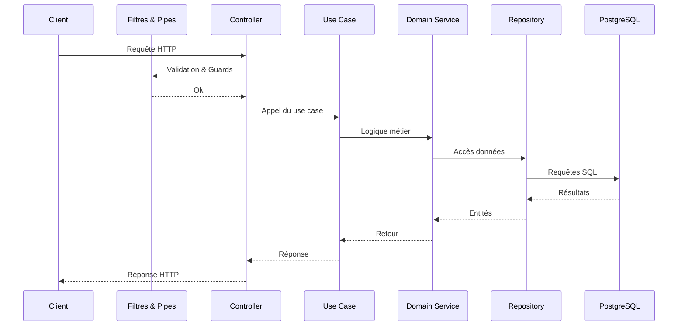

# 🛠️ Infra Control - Backend API

> Gestion d’infrastructure pour les environnements critiques (laboratoires, VM, serveurs, salles)  
> API REST modulaire, sécurisée, avec authentification JWT + 2FA, orientée Domain Driven Design (DDD)

---

## 🚀 À quoi sert ce projet ?

**Infra Control** est une API backend permettant :

- 🔐 Authentification sécurisée (login/register + JWT + 2FA via QR Code)
- 🏢 Gestion d’utilisateurs, rôles et permissions
- 🖥️ Contrôle d’objets d’infrastructure (machines, VMs, serveurs, racks)
- 🧩 Architecture modulaire et scalable (feature-first, DDD)

---

## 📦 Stack technique

- **NestJS 11** avec `@nestjs/typeorm`
- **TypeORM** + PostgreSQL
- **Passport + JWT**
- **2FA avec Speakeasy + QRCode**
- **Rate Limiting** multi-niveau (Helmet + express-rate-limit)
- **Swagger** auto-documenté
- **Docker** ready
- **Prometheus** pour le monitoring
- **Grafana** pour les dashboards

## 🔄 Flux complet de la requête

Cette vue d'ensemble montre le chemin parcouru par une requête HTTP depuis le client jusqu'à la base de données.



---

## ⚙️ Requirements

### ✅ Local

- Node.js `^20.x`
- pnpm `^8.x`
- PostgreSQL (ou Docker pour l’avoir intégré)
- Docker (optionnel mais recommandé)

### ✅ Variables d’environnement `.env`

```env
DB_HOST=localhost
DB_PORT=5432
DB_NAME=infra
DB_USERNAME=postgres
DB_PASSWORD=postgres

JWT_SECRET=jwt_secret
JWT_EXPIRATION=1h
JWT_2FA_TOKEN_EXPIRATION=5m
JWT_ACCESS_TOKEN_EXPIRATION=15m
JWT_REFRESH_TOKEN_EXPIRATION=7d

REDIS_HOST=localhost
REDIS_PORT=6379
REDIS_PASSWORD=redis
REDIS_USERNAME=redis
REDIS_TLS=true

FRONTEND_URL=http://localhost:5173
BACKEND_URL=http://localhost:3002

# Rate Limiting Configuration (voir docs/rate-limiting.md)
RATE_LIMIT_GLOBAL_WINDOW_MS=900000    # 15 minutes
RATE_LIMIT_GLOBAL_MAX=1000            # 1000 requests per window

RATE_LIMIT_AUTH_WINDOW_MS=900000      # 15 minutes  
RATE_LIMIT_AUTH_STRICT_MAX=5          # Login/register: 5 attempts
RATE_LIMIT_AUTH_MODERATE_MAX=10       # 2FA: 10 attempts

RATE_LIMIT_SENSITIVE_WINDOW_MS=3600000 # 1 hour
RATE_LIMIT_SENSITIVE_MAX=3             # 3 operations per hour

RATE_LIMIT_API_WINDOW_MS=300000       # 5 minutes
RATE_LIMIT_API_MAX=100                # 100 requests per window

GITHUB_TOKEN=
FRONT_REPO=Upstra/upstra-control_front
BACK_REPO=Upstra/upstra-control
```

Copy `.env-example` to `.env` (or rename `.env-local` to `.env`) and fill in your database credentials before running commands.

Note:

- Vous aurez besoin d'un `GITHUB_TOKEN` pour assurer le bon fonctionnement du module release, qui fetch les release front + back afin de les afficher au client

---

## 🐳 Démarrage avec Docker

Le script va s'occuper de lancer les containers:

- Prometheus (monitoring)
- Grafana (dashboards)
- NestJS (infra-control)

**Note**: En production sur Raspberry Pi, PostgreSQL et Redis sont installés nativement sans Docker.

```bash
# Pour lancer toute l'infra avec monitoring
./start_prod.sh
```

Puis l’API est dispo sur `http://localhost:3000`
La doc Swagger est dispo sur `http://localhost:3000/docs`
Le JSON du schéma est disponible sur `http://localhost:3000/docs-json`

### 📊 Monitoring avec Prometheus et Grafana

L'application expose des métriques Prometheus sur `/metrics`:

- **Prometheus**: `http://localhost:9090` - Collecte et stockage des métriques
- **Grafana**: `http://localhost:3001` - Visualisation des métriques
  - Login: admin / Password: admin

Les métriques incluent:
- Utilisation CPU et mémoire
- Event loop lag
- Handles et requêtes actives
- Statistiques de garbage collection

Pour ajouter des métriques personnalisées dans votre code:
```typescript
import { Counter, Histogram } from 'prom-client';

const httpRequestDuration = new Histogram({
  name: 'infra_control_http_request_duration_seconds',
  help: 'Duration of HTTP requests in seconds',
  labelNames: ['method', 'route', 'status']
});
```

---

## 🧪 Tests

Les tests sont organisés par **feature** avec :

- ✅ tests unitaires (`*.spec.ts`) pour DTOs, guards, use cases
- 🔒 tests e2e prévus pour `/auth`, `/users`, etc.

### 📥 Installation des dépendances

```bash
pnpm install
```

### ▶️ Lancer **tous** les tests

```bash
pnpm test
```

### 🔁 Lancer les tests en **mode watch**

```bash
pnpm test:watch
```

### 📊 Lancer les tests avec **couverture**

```bash
pnpm test:cov
```

#### Pour lancer la couverture sur un module spécifique :

```bash
pnpm test:cov -- src/modules/auth
```

#### Pour lancer la couverture sur un test spécifique :

```bash
pnpm test:cov -- src/modules/auth/__tests__/auth.controller.spec.ts
```

### 🧪 Lancer les **tests e2e**

```bash
pnpm test:e2e
```

---

## 🎯 Lancer uniquement les tests d’une feature (ex: `auth`)

```bash
pnpm test -- src/modules/auth
```

Ou même plus précis :

```bash
pnpm test -- src/modules/auth/__tests__/twofa.guard.spec.ts
```

---

## ✨ Structure de test

```bash
src/
└── modules/
    └── auth/
        ├── __tests__/                  # tests unitaires du controller, guards, etc.
        │   └── auth.controller.spec.ts
        ├── application/
        │   ├── use-cases/
        │   │   ├── login.use-case.ts
        │   │   └── __tests__/          # tests unitaires métier (DDD)
        │   │       └── login.use-case.spec.ts
        │   └── dto/
        │       ├── login.dto.ts
        │       └── __tests__/          # tests de validation class-validator
        │           └── login.dto.spec.ts
        ├── __mocks__/                  # mocks réutilisables (user, jwt, etc.)
        └── auth.controller.ts
```

---

## 🧼 Lint & format

```bash
pnpm lint      # corrige automatiquement
pnpm format    # beautifie le code
```

---

## 🗄️ Migrations

```bash
pnpm migration:generate
pnpm migration:run
```

Ces commandes utilisent `-r dotenv/config` pour charger automatiquement les variables d'environnement.

---

## 🔒 Sécurité et Rate Limiting

L'application intègre un système de sécurité multi-niveau :

### 🛡️ Protection des Headers (Helmet)
- Content Security Policy (CSP)
- Protection XSS et clickjacking
- Headers de sécurité automatiques

### ⚡ Rate Limiting Intelligent
- **Rate limiting global** : Protection DDoS générale
- **Rate limiting auth** : Limitation des tentatives de connexion/2FA
- **Rate limiting sensitif** : Protection des opérations critiques (rôles, permissions)
- **Rate limiting API** : Limitation de l'usage général

📖 **Documentation complète** : [docs/rate-limiting.md](docs/rate-limiting.md)

### Configuration des limites par environnement

Les variables peuvent être ajustées selon l'environnement :
- **Développement** : Limites permissives pour faciliter les tests
- **Production** : Limites strictes pour la sécurité

---

## ❤️ Tips

- Créer des mocks avec `__mocks__/createMockUser.ts` pour simplifier tes tests
- Il est possible de lancer `pnpm start:dev` pour du hot reload local

---

## ✍️ Auteurs

Projet réalisé dans le cadre du Master 2 en Architecture des Logiciels par :

[James ABIB](https://www.linkedin.com/in/jamesabib/)

[Ronan KIELT](https://www.linkedin.com/in/ronan-kielt/)

[Charles CRETOIS](https://www.linkedin.com/in/charles-cretois-43882a17b/)
