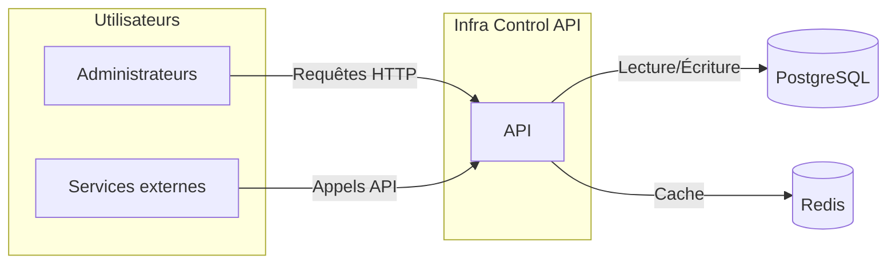

# 🏗️ Diagramme C4 - Contexte Système

Cette vue décrit l'API **Infra Control** dans son environnement global.

Ce premier niveau met en évidence les acteurs et dépendances
principales. Les utilisateurs (administrateurs et autres services)
interagissent avec l'API, qui communique avec la base de données
PostgreSQL ainsi qu'avec Redis pour la mise en cache.
