# 🏗️ Diagramme C4 - Niveau 2 : Conteneurs

Cette vue détaille les principaux conteneurs qui composent **Infra Control** et leurs interactions.

```mermaid
graph LR
    subgraph Clients
        A[Administrateurs]
        B[Services externes]
    end

    subgraph "Infra Control"
        API[NestJS API]
    end
    DB[(PostgreSQL)]
    REDIS[(Redis)]
    EXT[(Services externes)]

    A-->|Requêtes REST|API
    B-->|Appels API|API
    API-->|Lecture/Écriture|DB
    API-->|Cache|REDIS
    API-->|HTTP/SSH/etc.|EXT
```

Ce diagramme montre comment l'API NestJS communique avec la base PostgreSQL, Redis pour la mise en cache ainsi que d'autres services externes.
