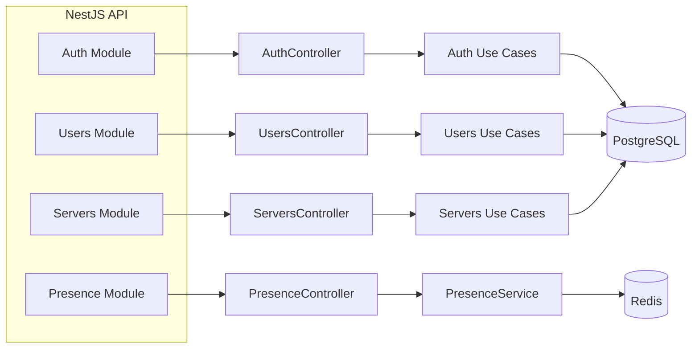

# 🏗️ Diagramme C4 - Niveau 3 : Composants

[1-System Context](./1-system-context.md)/[2-Container](./2-container.md)/3-Components/[4-Code](./4-code.md)

Cette vue zoome sur l'application NestJS et décrit quelques modules
avec leurs contrôleurs et use cases.

Ce diagramme simplifie l'organisation interne : chaque contrôleur
appelle des use cases, lesquels accèdent soit à la base de données,
soit au cache Redis pour la présence en ligne.

Le module **Presence** conserve pour chaque utilisateur connecté une clé
`presence:<userId>` dans Redis. Le TTL de 60 secondes est réinitialisé
régulièrement afin d'indiquer que la session est toujours active.
