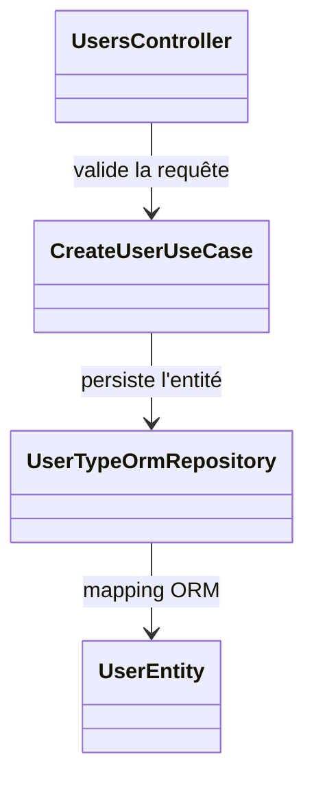

# 🏗️ Diagramme C4 - Niveau 4 : Code

[1-System Context](./1-system-context.md)/[2-Container](./2-container.md)/[3-Components](./3-components.md)/4-Code

Cette vue donne un exemple de représentation détaillée du code pour un use case.
Le diagramme ci-dessous illustre comment les classes interagissent lors de la
création d'un utilisateur.

Ce niveau optionnel sert à décrire plus finement les dépendances entre
contrôleurs, use cases et services bas niveau. Il peut être développé au fur et
à mesure des besoins.
