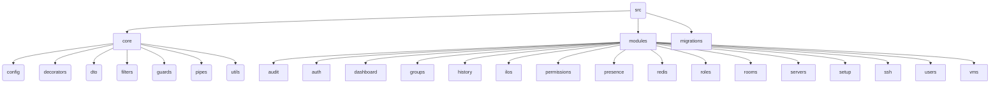

# 🗂️ Structure des modules

Vue synthétique des dossiers principaux du projet.

```mermaid
graph TD
    A(src)
    A --> B[core]
    A --> C[modules]
    A --> D[migrations]
    B --> B1(config)
    B --> B2(decorators)
    B --> B3(dto)
    B --> B4(filters)
    B --> B5(guards)
    B --> B6(pipes)
    B --> B7(utils)
    C --> C1[audit]
    C --> C2[auth]
    C --> C3[dashboard]
    C --> C4[groups]
    C --> C5[history]
    C --> C6[ilos]
    C --> C7[permissions]
    C --> C8[presence]
    C --> C9[redis]
    C --> C10[roles]
    C --> C11[rooms]
    C --> C12[servers]
    C --> C13[setup]
    C --> C14[ssh]
    C --> C15[users]
    C --> C16[vms]
```
