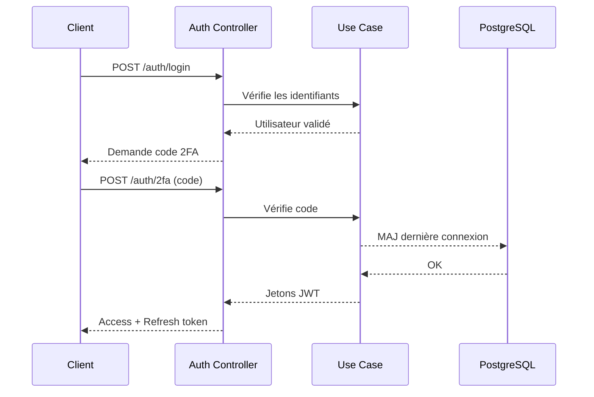
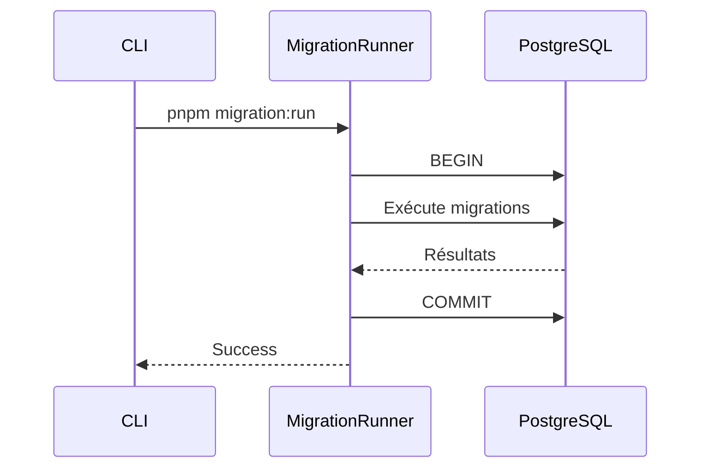

# 📚 Flux spécifiques

Cette section présente des exemples de diagrammes de séquence décrivant des flux internes de l'API.

## 🔐 Authentification 2FA

```mermaid
sequenceDiagram
    participant C as Client
    participant AuthCtrl as Auth Controller
    participant UC as Use Case
    participant DB as PostgreSQL

    C->>AuthCtrl: POST /auth/login
    AuthCtrl->>UC: Vérifie les identifiants
    UC-->>AuthCtrl: Utilisateur validé
    AuthCtrl-->>C: Demande code 2FA
    C->>AuthCtrl: POST /auth/2fa (code)
    AuthCtrl->>UC: Vérifie code
    UC-->>DB: MAJ dernière connexion
    DB-->>UC: OK
    UC-->>AuthCtrl: Jetons JWT
    AuthCtrl-->>C: Access + Refresh token
```

## 🗄️ Processus de migration

```mermaid
sequenceDiagram
    participant CLI as CLI
    participant Migrate as MigrationRunner
    participant DB as PostgreSQL

    CLI->>Migrate: pnpm migration:run
    Migrate->>DB: BEGIN
    Migrate->>DB: Exécute migrations
    DB-->>Migrate: Résultats
    Migrate->>DB: COMMIT
    Migrate-->>CLI: Success
```
